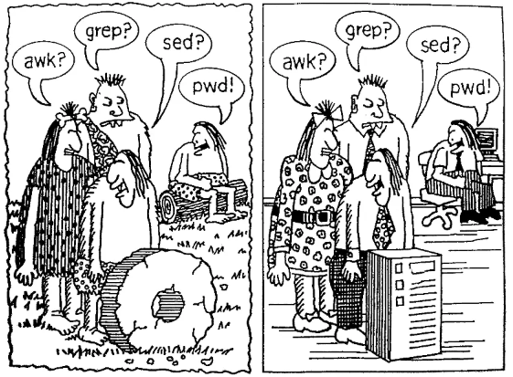
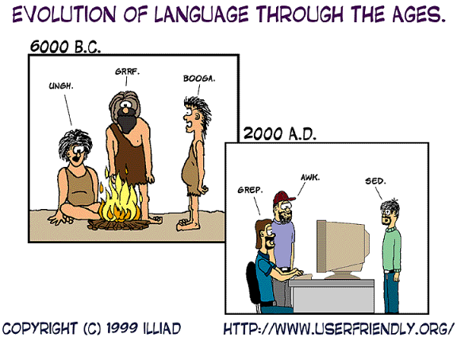
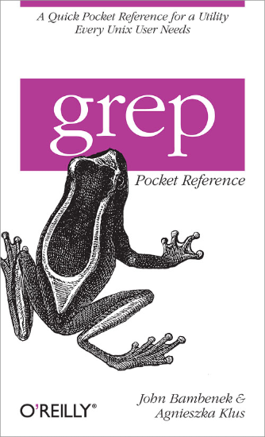

# grep 基本功（Learn grep）

```
grep，egrep，fgrep；上古神器；文本处理三剑客；文本过滤器
```





## 本仓库内容

1. grep基本功学习笔记

* GitBook:<https://yifengyou.gitbooks.io/learn-grep/content/>
* GitHub:<https://github.com/yifengyou/learn-grep/>
* GitPage:<https://yifengyou.github.io/learn-grep/>

```
Something I hope you know before go into the coding~
First, please watch or star this repo, I'll be more happy if you follow me.
Bug report, questions and discussion are welcome, you can post an issue or pull a request.
```

## 目录

* [grep简介](docs/grep简介.md)
* [grep基本语法](docs/grep基本语法.md)
* [grep标准选项](docs/grep标准选项.md)
* [grep工作原理](docs/grep工作原理.md)
* [grep环境变量](docs/grep环境变量.md)
* [grep退出码](docs/grep退出码.md)


## 参考



* Linux文本三剑客超详细教程 : <https://www.cnblogs.com/along21/p/10366886.html#auto_id_27>
*
## 小结
